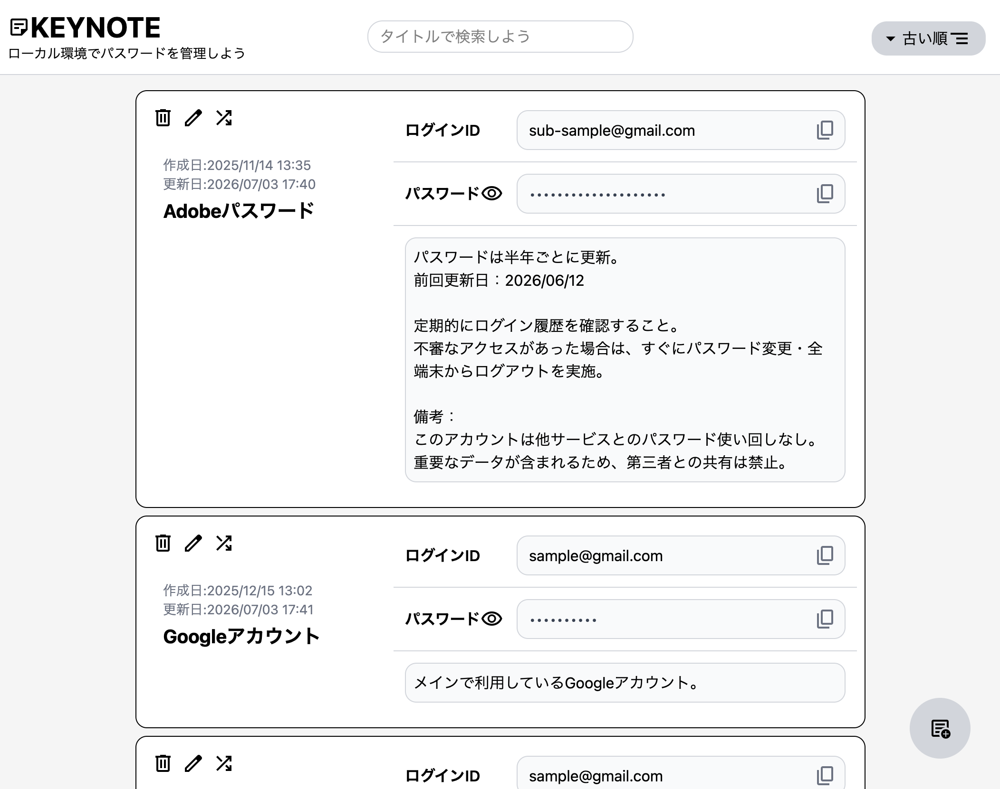
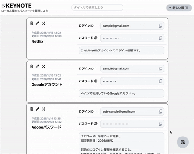
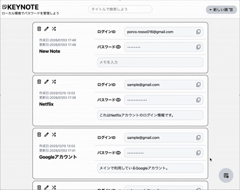
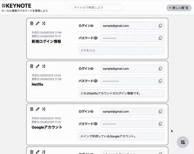

# KEYNOTE

  

これはパスワード管理に特化したメモアプリ「keynote」です。  
このwebアプリでは、ユーザーが安全に、かつわかりやすい形でメモを作成・管理できるように設計されています。

---

## アプリURL

https://soundporco.github.io/KeyNote_20250824/

---

## 開発背景

　このアプリの開発を考えていたタイミング、私はwebアプリ開発の学習を始めたばかりで、自分の学習をアプリ開発を通してアウトプットすることで形に残したいと考えていました。

　その時にちょうど様々なアカウントやwebサービスにアクセスすることが増えていたのですが、デフォルトのパスワードマネージャーなどでは上手くアカウントとユーザー情報の紐付けができていないことが多く、結局紙やメモ帳に書き留めることでパスワードの管理をしていました。そこで私はパスワード管理に特化したメモアプリを題材にすることにしました。

---

## 主な機能

- メモの作成・編集・削除
- メモの検索
- メモの並び替え
- パスワードの自動生成
- ユーザー情報のコピー機能

---

## 使用技術

- [javascript]
- [React]
- [tailwindcss]
- [html/css]
- [localStorage]

---

## 主な機能、アプリ画面

<!-- 1段目 -->

|                    メモ一覧                     |                  メモ作成・編集                  |
| :---------------------------------------------: | :----------------------------------------------: |
|  |  |
| メモの一覧を確認し、重要な情報にすぐアクセス。  |    メモの作成・編集を直感的に行える画面です。    |

<!-- 2段目 -->

|                      タイトル検索機能                      |                                                           パスワード自動生成機能                                                           |
| :--------------------------------------------------------: | :----------------------------------------------------------------------------------------------------------------------------------------: |
|            |                                                                                            |
| 画面上部中央の検索窓から目的のメモを素早く見つけられます。 | メモの左上のアイコンからパスワードの自動生成ができます。指定の条件を設定し生成し、確定ボタンにて自動的にメモのパスワード欄に反映されます。 |

---

## 工夫した点

### localStorageを利用したセキュリティ

パスワード管理アプリの開発を考え始めた段階で、真っ先にセキュリティ面の懸念が大きくありました。パスワード管理を題材にする以上、ユーザーの大切な情報を扱うことになるため、セキュリティ面の配慮は必須ですが、バックエンドの知識がまだ浅い段階で、セキュリティ面を考慮してサーバーサイドの実装を行うことは難しいと考えました。
そこで、ユーザーの情報をブラウザのlocalStorageに保存することで、サーバーに情報を経由せずにアプリを利用できるような設計にしました。パスワードやログインIDを含むユーザー情報は、ユーザーのブラウザ内にのみ保存されるため、外部からのアクセスや漏洩のリスクを低減できます。

このような設計のためユーザーも違うブラウザや端末ではアプリを利用することができませんが、セキュリティ面と現段階の開発スキルのバランスを考えた結果、本アプリはあくまでlocalStorageを利用した「メモアプリ」であるという位置付けで開発を進めました。

---

### 整理されたUIデザイン＆レスポンシブ対応

メモの数や内容が増えても視認性が損なわれないように、パスワード管理アプリとしてのUIデザインを意識しました。
また、スマートフォンやタブレットなどの様々なデバイスで快適に利用できるように、レスポンシブデザインはかなり強く意識をして開発に取り組みました。各端末や画面サイズで違和感なく表示されるようにアイコンやタイトルの位置はもちろん、inputタグのサイズや、そのvalueの有無による表示の差異を減らすなど、細かい部分まで調整を行いました。

---

### パスワードの自動生成による利便性の向上

様々なwebサービスを利用する中で、パスワードの使い回しがセキュリティ上のリスクになることはよく知られていますが、実際にパスワードを使い分けることは面倒で、私自身ついつい同じパスワードを使い回してしまうことが多いと感じていました。そこでパスワードマネージャーのように、パスワードの自動生成機能を実装しました。
現在の使用ではパスワードの桁数、大文字小文字や数字、記号の有無を指定してランダムなパスワードを生成することができます。
がしかし、この機能に関してはアイコンの位置の分かりにくさやパスワードのカスタマイズ性、複雑性の向上などまだまだ改善の余地があると感じています。

---

## 今後の改善

- タグ付けによるメモの整理機能
- タグやメモ内容での検索
- UI.UXの改善
- パスワードの自動生成機能の改善

---

## 作者

GitHub: [GitHub URL]
